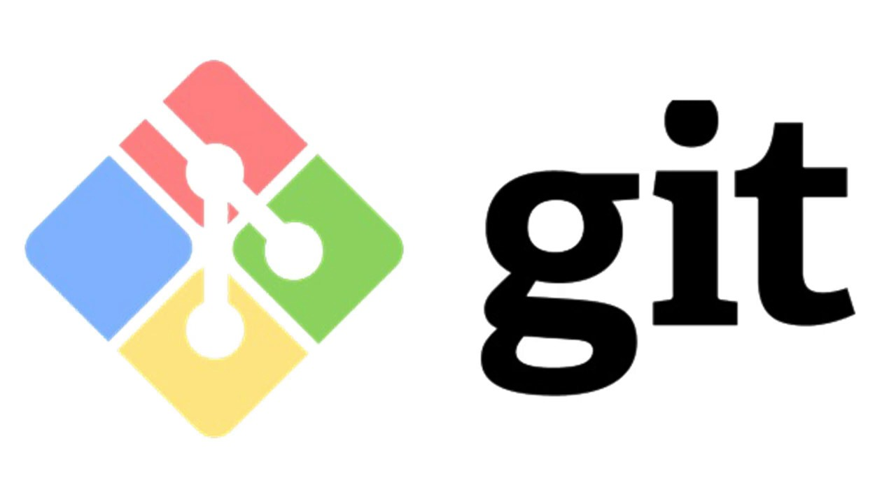

## Основные команды первого семинара по Git

> **git init** - *инициализация локального репозитория*

> **git status** - *получить информацию от git о текущем состоянии*

> **git add** - *добавить файл или файлы к следующему коммиту*

> **git commit -m “message”** - *создание коммита*

> **git log** - *просмотреть журнал коммитов*

> **git checkout** - *перемещение между сохранениями/ветками*

> **git checkout master** - *вернуться к актуальному состоянию и продолжить работу*

> **git diff** - *увидеть разницу между текущим файлом и закоммиченным файлом*

[ссылка на git](https://git-scm.com/downloads)